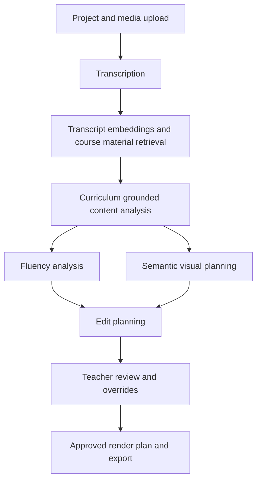

# AI Video Editor

An academic Final Year Project for producing reviewable educational-video edits from lecture recordings and uploaded course material.

The system transcribes lecture recordings, grounds editing decisions in course material, plans layouts against real slide and page assets, and lets a teacher review and change the proposed edit before rendering.

**Project status:** academic prototype and thesis source snapshot. The recorded full source verification is dated 21 June 2026. On 25 September 2026, the local Docker API was rechecked: it was healthy and returned the saved project list. That check does not replace the full build and test results linked below.

[Features](#main-capabilities) · [Architecture](#implemented-workflow) · [Quick start](#development-setup) · [Evidence](#evidence-and-thesis-documents) · [Data and privacy](#security-and-privacy)

## Current project state

This repository contains the final thesis source snapshot of the project, including the full desktop/backend implementation, verification assets, synthetic evaluation fixtures, reproducibility notes, and the thesis evidence/context pack.

| Item | Status |
|---|---|
| Main workflow | Implemented end to end from upload through reviewable edit planning and export |
| Desktop application | React 19, TypeScript, Tailwind CSS, Tauri 2 |
| Backend API | FastAPI, Pydantic, SQLAlchemy, Alembic |
| AI routing | Hosted, local, and hybrid provider paths for speech/LLM workflows |
| Course material support | PDF, PPTX, DOCX extraction plus renderable slide/page assets |
| Rendering | Native FFmpeg compositor, semantic render plans, Revideo integration, export artifacts |
| Evidence package | Static audit, test results, evaluation templates, source-package reproduction guide |
| Full source verification | 21 June 2026; see the linked verification report |
| Local API check | 25 September 2026; HTTP 200 and healthy Docker backend |

## Implemented workflow



The processing pipeline pauses after edit planning. Rendering is started only after teacher approval, so AI-generated transcript evidence, curriculum labels, slide/page decisions, layout choices, and cut recommendations remain reviewable.

## Main capabilities

- Guided desktop workflow for project creation, media upload, processing, review, layout inspection, and export.
- Configurable AI providers with hosted API, local transcription, and hybrid processing modes.
- Transcript timeline, word-level decisions, sectioning, clean-step suggestions, and manual teacher overrides.
- Course-material grounding through extracted text, RAG metadata, and exact PDF/PPTX page rendering.
- Semantic visual planner that aligns lecture windows with slide/page candidates and layout cues.
- Export presets, progress tracking, cancellation support, audio-only export, evaluation reports, and artifact bundles.
- Privacy-safe synthetic media fixtures and evaluation templates for thesis/demo evidence.

## Repository structure

```text
backend/
  app/
    agents/                 Five processing agents and orchestrator
    api/routes/             Project, media, review, model and debug endpoints
    db/                     SQLAlchemy database configuration and models
    models/                 Pydantic request and response schemas
    providers/              Speech/LLM provider adapters and defaults
    rag/                    Qdrant vector-store integration
    services/               Rendering, planning, export and support services
    alembic/versions/       Database migrations
  tests/                    Canonical automated test suite
  revideo/                  Backend Revideo render support
desktop/
  src/                      React teacher-facing desktop interface
  src-tauri/                Tauri desktop shell and backend bootstrap
  revideo/                  Desktop-side Revideo scene and render entry points
docs/
  fyp_context_pack/         Thesis/report evidence, inventories, results and audit notes
  reproducibility/          Source-package and thesis reproduction guidance
fixtures/
  synthetic_media/          Privacy-safe synthetic evaluation source fixtures
scripts/                    Verification, setup and source-package utilities
```

## Evidence and thesis documents

Start here when reviewing or writing about the project:

- [FYP context pack overview](docs/fyp_context_pack/00_README.md)
- [Executive project snapshot](docs/fyp_context_pack/01_EXECUTIVE_PROJECT_SNAPSHOT.md)
- [System architecture](docs/fyp_context_pack/03_SYSTEM_ARCHITECTURE.md)
- [Rendering/export evidence](docs/fyp_context_pack/09_RENDERING_EXPORT_AND_MEDIA_PROCESSING.md)
- [Testing, build and quality status](docs/fyp_context_pack/15_TESTING_BUILD_AND_QUALITY_STATUS.md)
- [Evaluation readiness and measurement](docs/fyp_context_pack/16_EVALUATION_READINESS_AND_MEASUREMENT.md)
- [Final audit verdict](docs/fyp_context_pack/25_FINAL_AUDIT_VERDICT.md)
- [Render regression fix update](docs/fyp_context_pack/27_RENDER_FIX_UPDATE_2026-06-16.md)
- [Reproducibility guide](docs/reproducibility/REPRODUCIBILITY_GUIDE.md)
- [Verification results](docs/reproducibility/VERIFICATION_RESULTS.md)

The context pack is code-grounded and intended to support Chapters 1-5, technical-paper compression, figure recreation, and evaluation planning. It should not be treated as human-study results unless the corresponding evaluation has actually been run.

## Development setup

### Requirements

- Docker Desktop with Docker Compose
- FFmpeg and FFprobe
- Node.js compatible with the lockfiles
- Rust toolchain for Tauri builds
- Python virtual environment with the backend requirements installed
- Provider credentials for selected hosted AI routes

Copy the configuration template and provide local values:

```powershell
Copy-Item .env.example .env
```

Never commit `.env`; it is intentionally ignored.

### Backend services

```powershell
docker compose up -d --build
```

The API is available at `http://localhost:8000`, with interactive documentation at `/docs`.

### Where project data lives

- Uploaded media and course materials are stored under `uploads/`.
- PostgreSQL, Qdrant, Redis, and rendered-video storage use Docker named volumes declared by `docker-compose.yml`.
- Copying the source folder alone does not back up those Docker volumes. Back them up separately before changing Docker or storage configuration.

### Desktop development

```powershell
Set-Location desktop
npm install
npm run dev
```

For the native desktop application:

```powershell
npx tauri dev
```

## Verification

The final thesis source snapshot was checked with:

```powershell
.\.venv\Scripts\python.exe -m unittest discover -s backend\tests -p "test_*.py"
npm run build --prefix desktop
cargo check --manifest-path desktop\src-tauri\Cargo.toml
docker compose config --quiet
```

The recorded result is in [docs/reproducibility/VERIFICATION_RESULTS.md](docs/reproducibility/VERIFICATION_RESULTS.md): 193 backend tests passed, the React/TypeScript production build completed, Tauri/Rust integration passed, and Docker Compose configuration validated.

## Reproducible source package

The thesis source package is generated with:

```powershell
.\.venv\Scripts\python.exe scripts\generate_thesis_source_package.py
```

The generator creates a sanitised archive, source manifest, summary and SHA-256 checksum under `output/thesis_source_package/`. Dependencies, credentials, media, caches, generated outputs and local analysis folders are excluded.

See [docs/reproducibility/REPRODUCIBILITY_GUIDE.md](docs/reproducibility/REPRODUCIBILITY_GUIDE.md) for the final-freeze and appendix workflow.

## Security and privacy

Do not include the following in a source release or thesis submission:

- `.env` or API keys
- uploaded recordings or course material without permission
- database dumps containing personal data
- provider logs containing credentials
- generated media unless explicitly required as evaluation evidence

Use `.env.example` to document configuration fields safely.

## Project status

This repository is an academic prototype developed for a Final Year Project. Reported evaluation findings must be tied to a specific Git commit, source-package checksum, provider/model configuration, and evaluation date.
