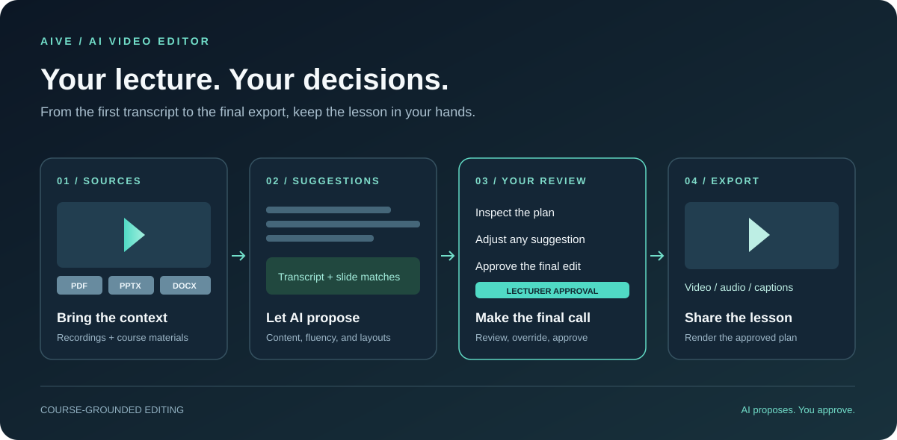

<h1 align="center">
   AIVE
</h1>

<p align="center">
  <strong>Turn lecture recordings into lessons worth watching.</strong><br />
  AI-assisted video editing, grounded in your course materials. You make the final call.
</p>

<p align="center">
  <a href="https://github.com/desanv01/ai-video-editor/stargazers"></a>
  
  
  
</p>

<p align="center">
  <a href="#features">Features</a> ·
  <a href="#get-started">Get started</a> ·
  <a href="docs/README.md">Documentation</a> ·
  <a href="https://github.com/desanv01/ai-video-editor/issues">Feedback</a>
</p>

<p align="center">
  
  <br /><sub>Workflow illustration · AI proposes. The lecturer approves.</sub>
</p>

## Why AIVE

Editing a lecture involves more than cutting pauses. The right explanation needs the right slide, the spoken content needs to stay intact, and the lecturer needs a way to check every decision.

AIVE brings recordings, course materials, transcripts, and editing decisions into one project. It proposes changes using your course context, gives you a reviewable plan, and renders after your approval.

## Features

<table>
<tr>
<td width="50%" valign="top">

### Your course, in context

Bring lecture video, audio, PDFs, PowerPoint slides, and Word documents into a shared project. AIVE extracts text and page assets to support content analysis and visual matching.

</td>
<td width="50%" valign="top">

### From speech to editable content

Transcribe recordings with configured hosted, local, or hybrid speech routes. Review the transcript and proposed content sections alongside the original recording.

</td>
</tr>
<tr>
<td width="50%" valign="top">

### Slides that follow the explanation

Use course context to propose relevant pages, slide matches, and visual layouts. Inspect the evidence and adjust how the recording and materials appear together.

</td>
<td width="50%" valign="top">

### Every edit stays in your hands

Review AI suggestions, change transcript and visual decisions, and apply manual overrides. Your approval is required before final rendering.

</td>
</tr>
<tr>
<td width="50%" valign="top">

### Export the lesson

Render approved edits through FFmpeg and export video, audio, captions, and supporting artifacts. Keep the edit plan and its evidence alongside the final media.

</td>
<td width="50%" valign="top">

### Keep the complete transcript

Download the stored original transcript as TXT, timestamped TXT, JSON, or segment CSV—even before rendering, including speech removed from the edit.

[Transcript guide →](docs/transcripts.md)

</td>
</tr>
</table>

## How it works

1. **Create a project.** Add your recording and supporting course materials.
2. **Process the sources.** AIVE transcribes speech, retrieves course context, and proposes content and visual edits.
3. **Review the plan.** Inspect the transcript, slide matches, layouts, and warnings. Adjust or override suggestions.
4. **Approve and export.** Render your approved plan and download the lesson and supporting files.

## Get started

**Current availability:** AIVE is a source-based preview for local use. This repository provides the Docker-backed application and browser development interface. The separate [AIVE Desktop V2](https://github.com/desanv01/ai-video-editor-desktop-v2) repository tracks the newer standalone Windows application.

### Run locally on Windows

You'll need Git, Docker Desktop with Compose v2, and Node.js/npm. The supplied Compose configuration reserves an NVIDIA GPU; it requires a working NVIDIA Container Toolkit setup. See the [setup guide](docs/getting-started.md) for configuration and native-shell requirements.

```powershell
git clone https://github.com/desanv01/ai-video-editor.git
Set-Location ai-video-editor
Copy-Item .env.example .env
# Set credentials and provider options in .env before starting.

docker compose up -d --build
Invoke-RestMethod http://localhost:8000/health

npm ci --prefix desktop
npm run dev --prefix desktop
```

Open the Vite URL printed in the terminal, normally **http://localhost:1420**. The API reference runs at **http://localhost:8000/docs**.

Provider-backed processing requires credentials for the selected services. Hosted providers may receive recordings or course content when used. The application has no sign-in layer; run it on a trusted local machine or network.

## Built with

| Interface | Processing & API | Storage & retrieval | Media |
| --- | --- | --- | --- |
| React · TypeScript · Tailwind · Tauri | FastAPI · Python · five processing stages | PostgreSQL · Qdrant · filesystem | FFmpeg · FFprobe |

[Architecture and runtime →](docs/architecture.md)

## Documentation

- [Setup and configuration](docs/getting-started.md)
- [Architecture and repository map](docs/architecture.md)
- [Original transcript downloads](docs/transcripts.md)
- [Contributing and development checks](CONTRIBUTING.md)
- [Recorded build and test results](docs/reproducibility/VERIFICATION_RESULTS.md)

## Feedback & contributions

Found a problem or have an idea? [Open an issue](https://github.com/desanv01/ai-video-editor/issues) with the workflow, expected result, and a reproducible example. Use synthetic or permission-cleared media, and keep recordings, course files, and credentials out of public reports.

Want to improve AIVE? Start with the [contribution guide](CONTRIBUTING.md). [Star the repository](https://github.com/desanv01/ai-video-editor) to keep it on your radar.
