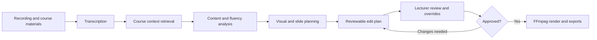

# AIVE architecture

AIVE links source recordings and course materials to a reviewable edit plan. The lecturer can adjust decisions before an approved plan is rendered.



## Runtime

| Layer | Implementation |
| --- | --- |
| Interface | React 19, TypeScript, Tailwind CSS, and Tauri 2 |
| API | FastAPI, Pydantic, SQLAlchemy, and Alembic |
| Processing | Direct asynchronous Python orchestration across five specialised stages |
| Relational state | PostgreSQL 16 for projects, transcripts, segments, scenes, plans, assets, and settings |
| Retrieval | Qdrant for course-material and transcript vectors when retrieval is used |
| Media | Filesystem storage with FFmpeg/FFprobe native composition |
| Optional integrations | Hosted providers, local whisper.cpp transcription, hybrid transcription, and MCP tools |

The supplied Compose configuration provisions Redis, but the recorded architecture audit found no active Redis client in the normal application path. Revideo/Puppeteer is disabled by default. LangGraph is a dependency but is not connected to the active orchestrator; n8n is legacy. These components should not be treated as required active processing stages.

## Repository map

```text
backend/
  app/                  API routes, processing agents, providers, RAG, services
  tests/                Backend checks
  alembic/              Database migrations
desktop/
  src/                  React interface
  src-tauri/            Tauri shell and backend bootstrap
  revideo/              Optional scene/render integration
docs/
  assets/               README brand and workflow artwork
  reproducibility/      Recorded verification and setup evidence
fixtures/               Synthetic media fixtures
scripts/                Setup, verification, and source-package utilities
docker-compose.yml      Browser/development services
docker-compose.desktop.yml
                        Packaged-shell services and host storage mounts
```

Older implementation and evaluation records remain in `docs/` for traceability. The [documentation index](README.md) is the entry point for current product guides.

## Application modes

The browser interface uses the standard Compose API on port 8000. The Tauri shell uses a separate Compose configuration with a loopback API on port 18000 by default. Storage and databases can differ between modes.

The separate [AIVE Desktop V2 repository](https://github.com/desanv01/ai-video-editor-desktop-v2) contains the newer managed native engine and standalone Windows application.
